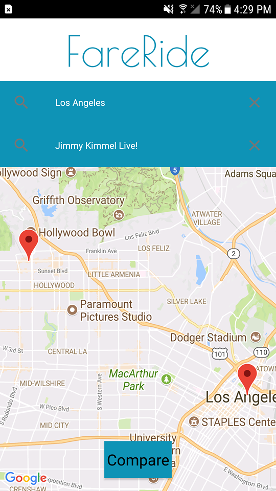
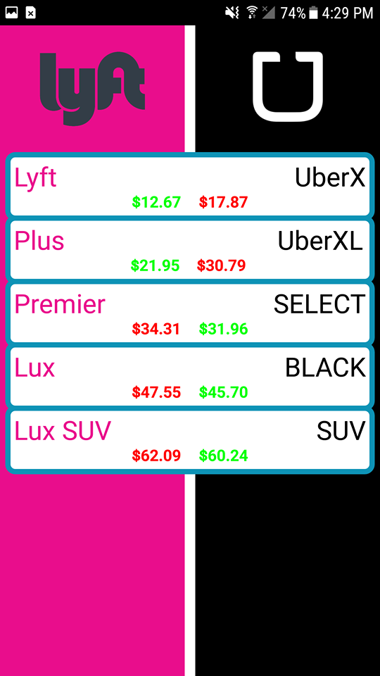

# This project is still in development, download links and more information will be updated upon completion. 

# FairRide

This andriod application compares Uber and Lyft prices to help users determine which one is cheaper. 

This repository contains the source code for the FairRide Android app.

## Built With

* [Google Maps API](https://developers.google.com/maps/) - The map used
* [Google Places API](https://developers.google.com/places/) - The search bar used
* [DynamoDB](https://console.aws.amazon.com/dynamodb) - The database service used

## Authors

* **Stephen Fung** - *Backend* - [Stephenfung98](https://github.com/stephenfung98)
* **Jay Lliguichushca** - *Frontend* - [Jayll](https://github.com/jayll)

See also the list of [contributors](https://github.com/stephenfung98/PennApps18/graphs/contributors) who participated in this project.

## License

This project is licensed under the MIT License - see the [LICENSE](LICENSE) file for details
